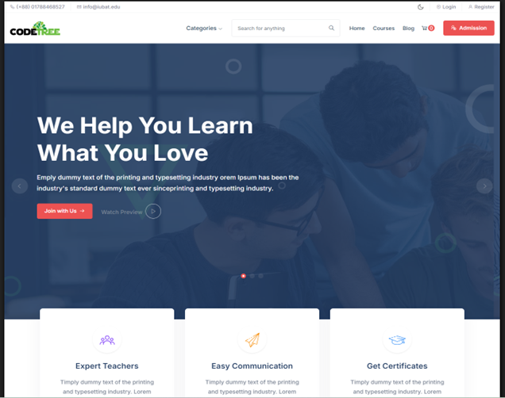
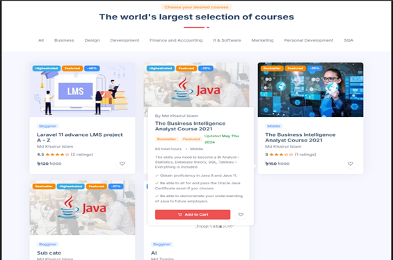
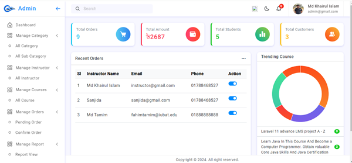
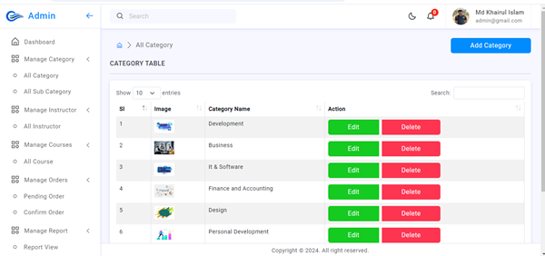
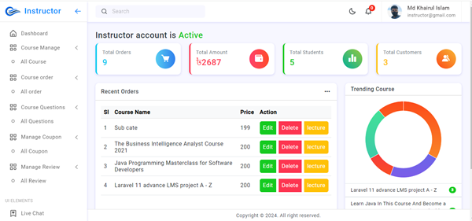
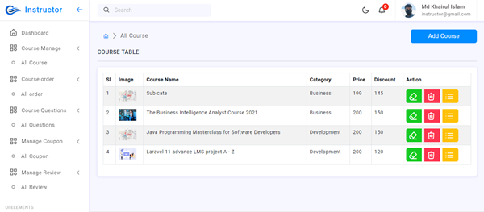

# 📚 Course Buy — Learning Management System

> **A full-featured online course buying, selling & sharing platform built with Laravel & MySQL**


---

## 🚀 Project Overview

**Course Buy** is a web-based Learning Management System developed for **Code Tree Academy**. It allows users to buy, sell, and share online courses through a streamlined, user-friendly platform. The system features three distinct role-based panels — Admin, Instructor, and Student.

> 🎓 Developed as Practicum project — IUBAT, BSc in Computer Science & Engineering (Summer 2024)

---

## ✨ Key Features

### 👑 Admin Panel
- Manage users, roles & permissions
- Approve/reject instructor & course listings
- Category & blog management
- Coupon system management
- View transaction & order history
- Send email notifications to users
- Full dashboard with analytics

### 🎓 Instructor Panel
- Create and manage courses & sections
- Upload lectures and course materials
- View orders, reviews & earnings
- Create and manage coupons
- Live chat with enrolled students

### 👤 Student Panel
- Browse and search available courses
- Buy courses with secure payment
- Access purchased course content
- Leave ratings & reviews
- Live chat with instructor
- Email verification on registration

---

## 🛠️ Tech Stack

| Layer | Technology |
|---|---|
| Backend | PHP, Laravel Framework |
| Frontend | HTML5, CSS3, JavaScript, Blade Templating |
| Database | MySQL, phpMyAdmin |
| Auth | Laravel Auth + Email Verification |
| IDE | Visual Studio Code |
| Methodology | Agile (Iterative Development) |

---

## 🗄️ Database Design

The system includes the following core tables:

- `users` — Student, Instructor, Admin roles
- `courses` — Course listings with details
- `course_sections` — Course chapter/section management
- `course_lectures` — Individual lecture entries
- `orders` — Purchase transaction records
- `payments` — Payment processing records
- `categories` — Course categorization
- `coupons` — Discount coupon management
- `blog_posts` — Platform blog content

---

## 📸 Screenshots

### 🏠 Home Page


### 📚 Course Listings


### 🖥️ Admin Dashboard


### ➕ Admin — Add Category


### 🎓 Instructor Dashboard


### ✏️ Instructor — Add Course


---

## ⚙️ Installation & Setup

```bash
# 1. Clone the repository
git clone https://github.com/Khairul-hub/course-buy-lms.git
cd course-buy-lms

# 2. Install dependencies
composer install
npm install

# 3. Configure environment
cp .env.example .env
php artisan key:generate

# 4. Setup database
# Create a MySQL database named: course_buy
# Update .env with your DB credentials

# 5. Run migrations
php artisan migrate

# 6. Seed sample data (optional)
php artisan db:seed

# 7. Serve the application
php artisan serve
```

Then open: `http://localhost:8000`

---

## 🔐 Default Login Credentials

| Role | Email | Password |
|---|---|---|
| Admin | admin@coursebuy.com | password |
| Instructor | instructor@coursebuy.com | password |
| Student | student@coursebuy.com | password |

---

## 📋 System Requirements

- PHP >= 8.0
- Composer
- MySQL >= 5.7
- Node.js & NPM
- Laravel >= 9.x

---

## 🧪 Testing

The system was tested using:
- **Black Box Testing** — Functional behavior testing
- **White Box Testing** — Internal logic & code path testing

All 7 core test cases passed ✅

---

## 🏢 Developed At

**Code Tree IT Ltd**
House 77 (Level-10), Road 13, Sector 10, Uttara, Dhaka-1230, Bangladesh

---

## 👨‍💻 Developer

**Md Khairul Islam**
- 🎓 BSc in Computer Science & Engineering — IUBAT (2024)
- 💼 Full Stack Developer & Network Engineer
- 🌐 Portfolio: [khairulhub.vercel.app](https://khairulhub.vercel.app)
- 💻 GitHub: [@Khairul-hub](https://github.com/Khairul-hub)
- 📧 Email: khairulhub@gmail.com

---

## 📄 License

This project was developed for academic purposes as part of the IUBAT Practicum requirement (CSC490).

---

⭐ **If you found this project helpful, please give it a star!**
